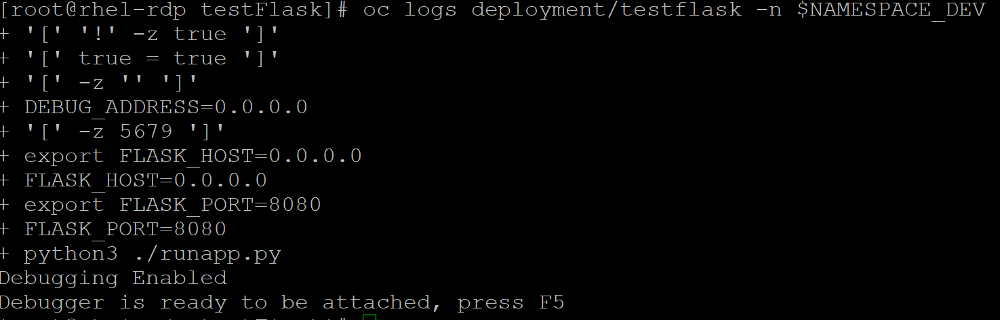
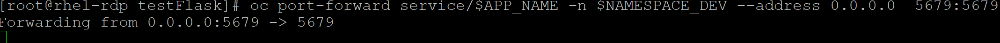
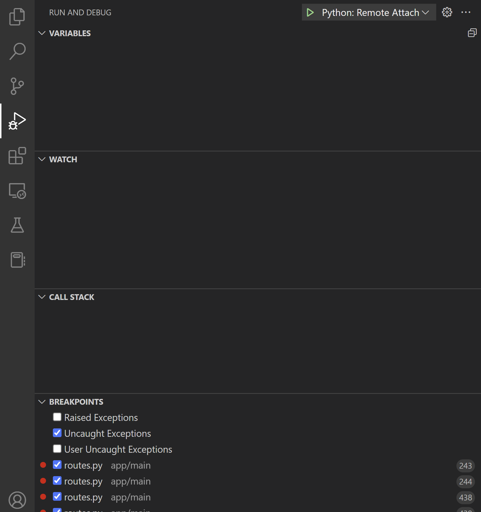
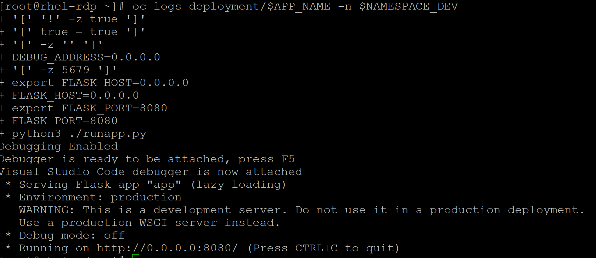

# python-openshift-remote-debugging-vscode-example
Repo provides an example of remote debugging a Python Application(Flask) on Kubernetes/OpenShift with VSCode.

## Contents
- Repo uses python [debugpy](https://github.com/microsoft/debugpy.git) as debugger.
- Application used for example is [testFlask Application](https://github.com/MoOyeg/testFlask.git)
- Example uses a [Dockerfile](https://github.com/MoOyeg/testFlask/blob/master/Dockerfile) to build application image.
- Dockerfile entrypoint points to [bash script](https://github.com/MoOyeg/testFlask/blob/master/runapp.sh) that helps determine if remote debugging is needed via the use of environment variables.
- if Debugging is needed bash script will run python [flask entrypoint file](https://github.com/MoOyeg/testFlask/blob/master/runapp.py) which imports debug intializer from another file if required.

## Helpful-Sources
- [debugpy](https://github.com/microsoft/debugpy)
- [Debugging Approach Example](https://lightrun.com/how-to-perform-python-remote-debugging/)
- [Kubernetes Debugging with VSCode](https://developers.redhat.com/articles/2021/12/13/remote-debugging-kubernetes-using-vs-code#the_kubernetes_deployment
)

## General Prerequisites
- [OpenShift Cluster](https://docs.openshift.com/container-platform/4.9/welcome/index.html) - Version>=4.9
- [oc client](https://docs.openshift.com/container-platform/4.9/cli_reference/openshift_cli/getting-started-cli.html) >= 4.9
- oc client must be logged in with user with sufficent privileges to run below commands.

## Steps to Run

- ### Source Environment Variables

    ```bash
    eval "$(curl https://raw.githubusercontent.com/MoOyeg/testFlask/master/sample_env)"
    ```

- **Create necessary projects**  
```oc new-project $NAMESPACE_DEV```  
```oc new-project $NAMESPACE_PROD```

- **Create a new application on openshift, using the oc new-app command.We will specificy environment variables we pre-configured in our [entrypoint bash script](https://github.com/MoOyeg/testFlask/blob/master/runapp.sh) to enable debugging for our application**

    ```bash
    oc new-app https://github.com/MoOyeg/testFlask.git --name=$APP_NAME -l app=testflask --env=REMOTE_DEBUG="true" --env=DEBUG_PORT=5679 -n $NAMESPACE_DEV --strategy=docker
    ```
- **Expose the service to the outside world with an openshift route**

    ```bash
    oc expose svc/$APP_NAME --port 8080 -n $NAMESPACE_DEV
    ```

- **If app build above is successful our application pod should start in debug mode. We can confirm by looking at application logs.**
    ```bash
    oc logs deployment/$APP_NAME -n $NAMESPACE_DEV
    ```

    

- **With our application debugger listening we need to port-forward from our debug service to allow vscode connect.**

   ```bash
   oc port-forward service/$APP_NAME -n $NAMESPACE_DEV --address 0.0.0.0  5679:5679
   ```
    

- **With our debugger accessible we need to configure our vscode instance to connect to the debugging session. Port-Forward session has to continously run for duration of debugging**

  - Clone the original source code
    ```bash
       git clone https://github.com/MoOyeg/testFlask.git
    ```
  
  - Open folder in VSCode

  - Set your vscode setting.json to point to our created instance above and use the remote debug configuration. I have provided a sample settings.json with a remote debugger attach and local development example under .vscode folder.

     

  - Start debug session in vscode, we should see log in our application show a debug connection has been made.

    ```bash
    oc logs deployment/$APP_NAME -n $NAMESPACE_DEV
    ```

    

 - Calling our route URL for the application should trigger our breakpoints.
    ```bash
     curl $(oc get route/$APP_NAME -n $NAMESPACE_DEV -o jsonpath='{.spec.host}')
    ```
   